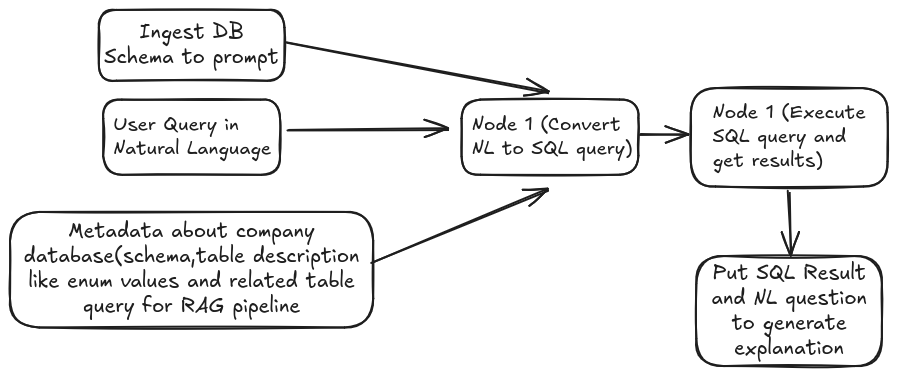
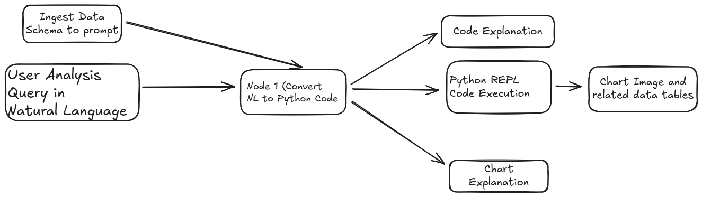

# Talk to Data: LLM-Based Dashboards and Reports from Data Lakehouse

## 1.Problem Statement:

The current process of generating dashboards and reports from data warehouses often involves complex ETL pipelines, predefined metrics, and limited user interaction. Business users frequently lack the ability to explore data dynamically, ask ad-hoc questions, and gain immediate insights from the vast amounts of data stored in the data lakehouse. This results in delays in accessing critical information, reliance on technical teams for even simple data exploration, and a potential disconnect between data insights and timely decision-making.

## 2.What is Talk to Data about?

This research focuses on leveraging Large Language Models (LLMs) to revolutionize the creation and consumption of dashboards and reports directly from a data lakehouse. It explores methods for enabling natural language interaction with data, allowing users to ask questions, request specific visualizations, and generate reports in an intuitive and conversational manner. The research will investigate consuming data both directly from raw tables and from pre-aggregated intermediate tables within the data warehouse to optimize for performance and flexibility. The context of Customer Data Platform (CDP) and customer 360, with a focus on customer segmentation and personalization, will serve as the application domain for this research.

## 3.Objective of Talk to Data:

Moving forward with this topic holds significant potential for several reasons:
    • Enhanced User Empowerment: LLM-powered interfaces can democratize data access, enabling business users without deep technical skills to directly interact with and extract insights from the data lakehouse.
    • Increased Efficiency and Speed: Automating the dashboard and report generation process through natural language queries can significantly reduce the time and effort required compared to traditional methods.
    • Improved Data Exploration and Discovery: LLMs can facilitate more flexible and exploratory data analysis, allowing users to ask nuanced questions and uncover hidden patterns that might be missed with predefined reports.
    • Personalized Insights for CDP and Customer 360: Applying this technology to CDP and customer 360 data can unlock deeper understanding of customer segments, preferences, and behaviors, leading to more effective personalization strategies.
    • Real-time and Ad-hoc Analysis: LLMs can enable users to ask real-time questions and generate on-demand reports, facilitating quicker responses to changing business needs and opportunities.
    • Potential for Innovation: This research can pave the way for novel ways of visualizing and interacting with data, going beyond traditional dashboard and report formats.

## 4.Expected outcomes from the research:

The research is expected to deliver the following outcomes:
    • A framework for building LLM-powered dashboards and reports: This will include architectural considerations, data access strategies (direct vs. intermediate tables), fine tuning, and integration points with the data lakehouse.
    • Sample implementations of approximately 50 dashboard tiles and 50 report elements: These samples will demonstrate the feasibility and capabilities of generating various visualizations and data summaries using natural language queries, covering common metrics and dimensions relevant to CDP and customer 360.
    • Evaluation of different LLM models and prompting techniques: The research will assess the performance, accuracy, and usability of various LLMs in the context of data interaction.
    • Performance analysis of querying raw vs. intermediate tables: The research will evaluate the trade-offs between flexibility and performance when consuming data from different layers of the data warehouse.
    • Insights into the potential impact of LLM-based data exploration on customer segmentation and personalization strategies: The research will explore how this technology can lead to more granular and actionable customer insights.
    • Identification of potential challenges and limitations: The research will also highlight any obstacles encountered and suggest future research directions.

# Talk to Data Project Description

## 1. Backend Project
### Technology Stack
- **Primary Language**: Python
- **Key Components**:
  - Flask API
  - SQL Database (SQLite with Chinook.db) (place your database url)
  - Data Analysis Tools (pandas, chart generation)
  - LLM Integration
  - MinIO Storage Integration

### Purpose
Serves as the main backend service handling data analysis, SQL queries, and chart generation. It includes features for data processing, analysis, and visualization.

## 2. Frontend Project
### Technology Stack
- **Primary Framework**: SvelteKit
- **Additional Technologies**:
  - TypeScript
  - Vite (Build tool)
  - Storybook (Component documentation)

### Purpose
Main user interface for interacting with the data analysis features. Built with modern web technologies focusing on performance and developer experience.

## 4. Infrastructure
### Technology Stack
- Docker
- Containerized Deployment

### Purpose
Manages the deployment and orchestration of all services, ensuring consistent development and production environments.

## Project Overview
Talk to Data is an LLM-powered dashboard and reporting system that enables natural language interaction with data stored in a data lakehouse(currently in a sqlite database). The project focuses on making data exploration and visualization accessible through conversational interfaces.

## Core Features
### 1. Natural Language Query Processing

It is the solution to the problem where Business professionals who doesn't know SQL to get the data from the database. Now, they can use natural language to run query to the databases.

The system uses CodeLlama to:
- Parse natural language questions
- Convert them to SQL/analysis queries
- Generate sql result and explanations.

### 2. Data Analysis Pipeline

```python
StateGraph(State).add_sequence([
    write_query,       # Converts natural language to SQL
    execute_sql_query, # Executes the query
    generate_answer    # Generates response/visualization
])
```

### 3. File Management
- Supports CSV upload
- MinIO integration for file storage
- Metadata extraction and content description

## Limitations

### Technical Constraints
1. Memory Requirements:
   - 7B models: 8GB RAM
   - 70B models: 140GB RAM

2. Processing Speed:
   - LLM inference time can impact response times
   - Complex queries may have performance overhead

### Functional Limitations
1. Query Complexity:
   - Limited to structured data analysis
   - May struggle with highly complex analytical queries

2. Visualization Types:
   - Pre-defined chart types only
   - Custom visualizations require manual implementation

## Deployment

### Requirements
```bash
# Hardware
- RAM: 8GB minimum (140GB+ for 70B models)
- Storage: 140GB+ free space
- GPU: 80GB VRAM for optimal performance

# Software
- Docker and Docker Compose
- Python 3.x
- Node.js for frontend
```

### Setup
1. Backend:
```bash
cd backend
pip install -r requirements.txt
python main.py
```

2. Frontend:
```bash
cd frontend
npm install
npm run dev
```

3. LLM Setup:
```bash
ollama run codellama
# or
ollama run codellama:13B
```

## Best Practices
1. Use intermediate tables for frequent queries
2. Implement proper error handling for LLM responses
3. Monitor memory usage with large models
4. Cache common query results
5. Implement rate limiting for API endpoints

## Future Improvements
1. Support for more complex data relationships
2. Enhanced visualization capabilities
3. Better query optimization
4. Multi-model LLM support
5. Advanced caching mechanisms

This system aims to democratize data access while maintaining performance and usability. Its modular architecture allows for future extensions and improvements.

## What It Does

Talk to Data is an intelligent data interaction system that:

1. **Natural Language Data Querying**
   - Allows users to ask questions about their data in plain English
   - Examples:
     - "Show me sales trends for last quarter"
     - "What were the top performing products?"

2. **Automated Analysis & Visualization**
   - Converts natural language to appropriate queries
   - Generates relevant visualizations automatically
   - Provides explanations in natural language

3. **Multi-source Data Integration**
   - Connects to various data sources:
     - SQL databases
     - CSV files
     - Data warehouses
     - Object storage (MinIO)

## Technical Architecture

### 1. Query Processing Pipeline

````python
from langgraph.graph import StateGraph

def process_query(query: str):
    graph = StateGraph()
    
    # Natural language understanding
    graph.add_node("parse", parse_query)
    
    # SQL generation
    graph.add_node("generate_sql", generate_sql_query)
    
    # Query execution
    graph.add_node("execute", execute_query)
    
    # Result formatting
    graph.add_node("format", format_results)
    
    return graph.run({"input": query})
````

### 2. Frontend Components

````typescript
<script lang="ts">
  import { createEventDispatcher } from 'svelte';
  
  export let query: string = '';
  const dispatch = createEventDispatcher();
  
  async function handleQuery() {
    const response = await fetch('/api/query', {
      method: 'POST',
      body: JSON.stringify({ query })
    });
    const result = await response.json();
    dispatch('result', result);
  }
</script>

<div class="chat-interface">
  <input bind:value={query} />
  <button on:click={handleQuery}>Ask</button>
</div>
````

## Core Features In-Depth

### 1. LLM Query Understanding
- Uses CodeLlama to:
  - Parse intent
  - Identify entities
  - Determine query type
  - Generate appropriate SQL

### 2. Data Processing
- Performs:
  - Data cleaning
  - Type inference
  - Schema validation
  - Query optimization

### 3. Visualization Engine
- Automatically selects appropriate chart types
- Supports:
  - Time series
  - Bar charts
  - Scatter plots
  - Heat maps
  - Custom visualizations

## Setup Instructions

````bash
# Install backend dependencies
cd backend
python -m venv venv
source venv/bin/activate
pip install -r requirements.txt

# Install frontend dependencies
cd frontend
npm install

# Start services
docker-compose up -d
````

## Configuration Example

````yaml
llm:
  model: "codellama:13b"
  temperature: 0.7
  max_tokens: 1000

database:
  type: "sqlite"
  path: "./data/chinook.db"

minio:
  endpoint: "localhost:9000"
  access_key: "${MINIO_ACCESS_KEY}"
  secret_key: "${MINIO_SECRET_KEY}"
````

<!-- ## Error Handling

````python
class QueryError(Exception):
    def __init__(self, message: str, query: str = None):
        self.message = message
        self.query = query
        super().__init__(self.message)

def handle_query_error(error: QueryError):
    logger.error(f"Query failed: {error.message}")
    return {
        "status": "error",
        "message": error.message,
        "query": error.query
    }
```` -->

## Limitations

1. **Query Complexity**
   - Limited to SQL-expressible queries
   - Cannot handle complex statistical analysis
   - No support for nested subqueries

2. **Performance**
   - LLM inference time: 1-3 seconds
   - Large dataset limitations
   - Memory constraints with 70B models

3. **Data Types**
   - Primarily structured data
   - Limited support for:
     - Binary data
     - Unstructured text
     - Image analysis

4. **Visualization**
   - Fixed set of chart types
   - Limited customization options
   - No interactive visualizations

5. **Security**
   - Basic authentication only
   - No row-level security
   - Limited access controls

This document will be updated as new features and improvements are added to the system.
.mp4)


https://github.com/Rohit-Karki/talk_to_data/blob/main/demoofllmproject(1).mp4
